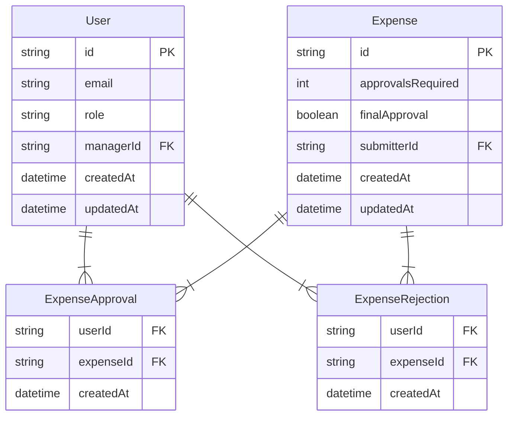

# Logical ERD

```mermaid
erDiagram
  User {
    string id PK
    string email
    string role
    string managerId FK
    datetime createdAt
    datetime updatedAt
  }

  Expense {
    string id PK
    int approvalsRequired
    boolean finalApproval
    string submitterId FK
    datetime createdAt
    datetime updatedAt
  }

  ExpenseApproval {
    string userId FK
    string expenseId FK
    datetime createdAt
  }

  ExpenseRejection {
    string userId FK
    string expenseId FK
    datetime createdAt
  }

  User ||--|{ ExpenseApproval : ""
  User ||--|{ ExpenseRejection : ""
  Expense ||--|{ ExpenseApproval : ""
  Expense ||--|{ ExpenseRejection : ""
```
